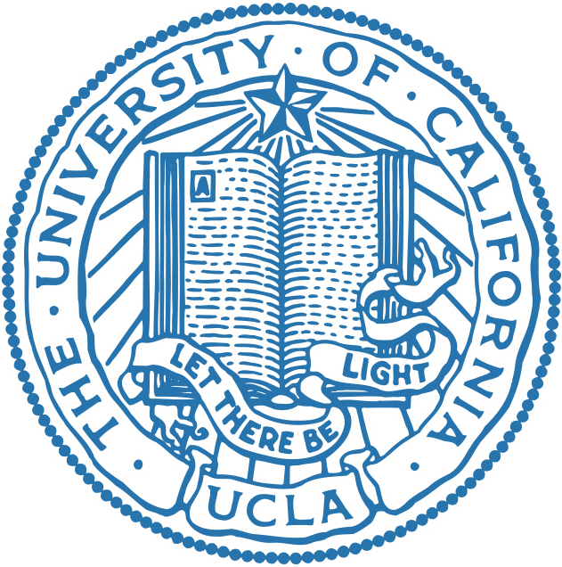

# neural-seq-decoder

Pytorch implementation of [Neural Sequence Decoder](https://github.com/fwillett/speechBCI/tree/main/NeuralDecoder) for UCLA EEC143A Final Project

## Installation

Use the package manager [uv](https://docs.astral.sh/uv/) to install neural-seq-decoder.

```bash
uv sync
```

## Usage

1. Convert the speech BCI dataset using [formatCompetitionData.ipynb](./notebooks/formatCompetitionData.ipynb)

2. Train model

```python
uv run scripts/train_model.py
```

## Contributing

Pull requests are welcome. For major changes, please open an issue first
to discuss what you would like to change.

Please make sure to update tests as appropriate.

## License

[MIT](https://choosealicense.com/licenses/mit/)
